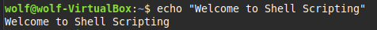
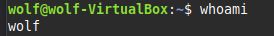
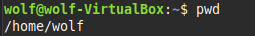
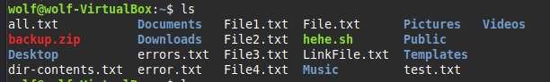
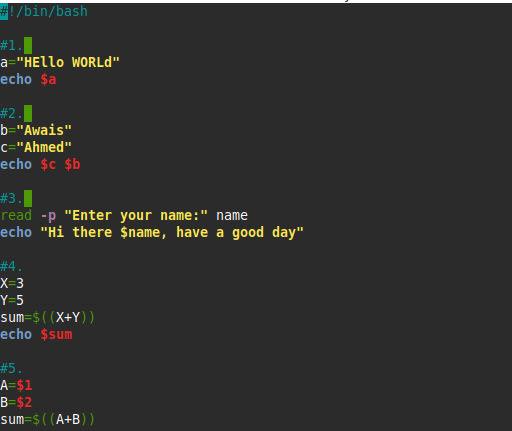
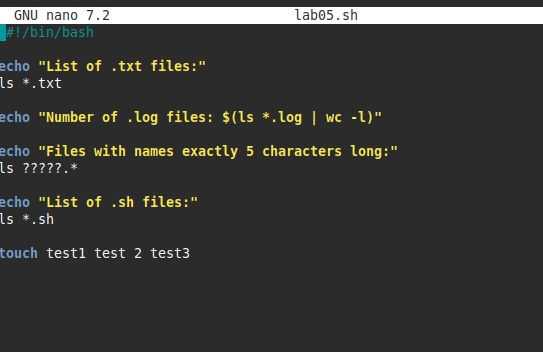
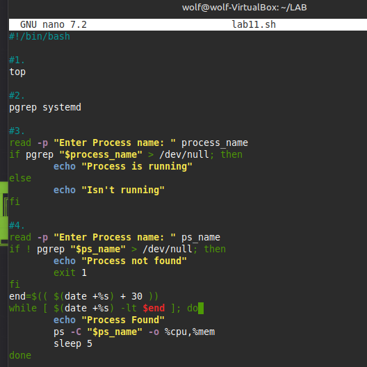
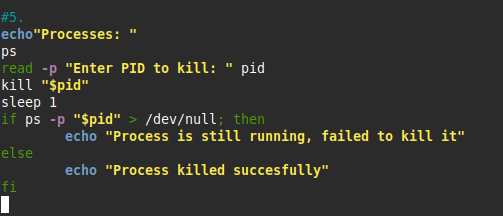
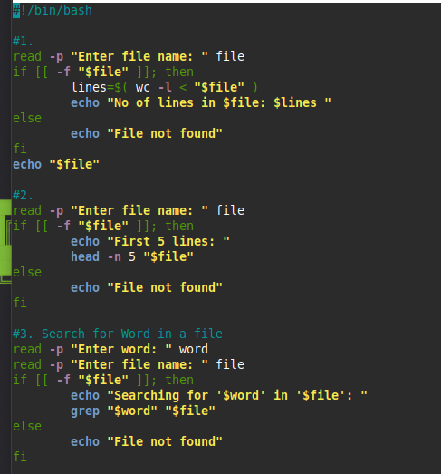
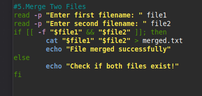

# Bash Scripts — Shell Scripting Labs

Shell scripts for system administration and security tasks, written as part of a
Digital Forensics & Cyber Security shell-scripting course. Twelve labs, progressing
from basic terminal commands to process management and file operations.

> **Roll No:** SP-2023/BS-DFCS/008 &nbsp;|&nbsp; **Name:** Awais Ahmed

## Contents

| Lab | Topic | Folder |
|---|---|---|
| 01 | Introduction to the Shell | [`lab01_intro_to_shell/`](lab01_intro_to_shell/lab01.sh) |
| 02 | Scripting Basics (dirs, permissions, aliases) | [`lab02_scripting_basics/`](lab02_scripting_basics/script_1.sh) |
| 03 | Variables | [`lab03_variables/`](lab03_variables/lab03.sh) |
| 04 | Command-Line Arguments | [`lab04_arguments/`](lab04_arguments/lab04.sh) |
| 05 | Wildcards & File Listing | [`lab05_wildcards_filetests/`](lab05_wildcards_filetests/lab05.sh) |
| 06 | Conditionals | [`lab06_conditionals/`](lab06_conditionals/lab06.sh) |
| 07 | Loops | [`lab07_loops/`](lab07_loops/lab07.sh) |
| 08 | Functions & Libraries | [`lab08_functions/`](lab08_functions/lab08.sh) |
| 09 | Arrays — Basics | [`lab09_arrays_basics/`](lab09_arrays_basics/lab09.sh) |
| 10 | Arrays — Practical Applications | [`lab10_arrays_advanced/`](lab10_arrays_advanced/lab10.sh) |
| 11 | Process Management | [`lab11_process_management/`](lab11_process_management/lab11.sh) |
| 12 | File Operations | [`lab12_file_operations/`](lab12_file_operations/lab12.sh) |

Every script is runnable with `bash script.sh` (or `./script.sh` after `chmod +x`).

---

## Lab 01 — Introduction to the Shell

Basic terminal commands: printing text, checking the current user, checking the
working directory, creating files, and listing directory contents.

```bash
echo "Welcome to Shell Scripting"
whoami
pwd
touch test.txt
ls
```

 
 


---

## Lab 02 — Scripting Basics

Creating and entering a directory, making a script executable, printing the date,
setting an alias, and doing basic arithmetic.

```bash
mkdir my_folder
cd my_folder
echo "Directory 'folder' created and entered"
cd ..
chmod u+x script_1.sh
echo "Today's date is: $(date)"
alias la="ls -a"
sum=$((5+3))
echo "The sum of 5 and 3 is: $sum"
```


---

## Lab 03 — Variables

Assigning/printing variables, reading input, arithmetic, and positional parameters.

```bash
a="HEllo WORLd"
echo $a

read -p "Enter your name:" name
echo "Hi there $name, have a good day"

X=3; Y=5
sum=$((X+Y))
echo $sum

A=$1; B=$2
sum=$((A+B))
```



---

## Lab 04 — Command-Line Arguments

Script name (`$0`), argument count (`$#`), argument list (`$@`), conditionals on
arguments, and swapping two variables using a temp variable.

```bash
echo "File_name: $0"
echo "No. of arguments: $#"
echo "Arguments are: $@"

if [ $# -eq 0 ]; then
	echo "No arguments provided"
else
	echo "Arguments provided: $1"
fi

temp=$var1; var1=$var2; var2=$temp
```


---

## Lab 05 — Wildcards & File Listing

Glob patterns to list files by extension and by fixed name length.

```bash
ls *.txt
echo "Number of .log files: $(ls *.log | wc -l)"
ls ?????.*        # names exactly 5 chars, any extension
ls *.sh
```



---

## Lab 06 — Conditionals

File/directory existence checks, numeric comparison, even/odd detection, empty
string checks, file-permission checks, and a `+ - * /` calculator with a
divide-by-zero guard.

```bash
if [ -f "test.txt" ]; then echo "File exists"; else echo "File does not exist"; fi

if [ $((number % 2)) -eq 0 ]; then echo "EVEN"; else echo "ODD"; fi

case "$op" in
    "+") echo "Result: $(($a + $b))" ;;
    "/") [ "$b" -ne 0 ] && echo "Result: $(($a / $b))" || echo "Error: Division by zero" ;;
esac
```

Full script: [`lab06_conditionals/lab06.sh`](lab06_conditionals/lab06.sh)

---

## Lab 07 — Loops

`for`, `while`, and `until` loops: counting, iterating words in a string, iterating
`who` output, a password-retry prompt, and two simple "security" checks — flagging
`.exe`/`.bat` files in Downloads and `.zip`/`.rar` files in a backup folder.

```bash
for i in {1..10}; do echo $i; done

until [ "$password" == "123" ]; do
  read -s -p "Enter password: " password
done

for file in ~/Downloads/*.{exe,bat}; do
  [ -e "$file" ] && echo "Suspicious file found: $file"
done

find ~/Downloads -type f -size +100M -exec ls -lh {} +
```

> **Note:** the original loop counting down from 5 (`while [ $num -ge 1 ]`) was
> missing its decrement and closing `done`, which would have caused an infinite
> loop — fixed in [`lab07_loops/lab07.sh`](lab07_loops/lab07.sh) with a comment
> marking the fix.

---

## Lab 08 — Functions & Libraries

Defining and calling functions, passing arguments, returning values via `echo`
and command substitution, conditional logic inside a function, a file-line-count
function, sourcing an external library (`math_library.sh`), and input validation
with a regex.

```bash
calculate_area() {
	local length=$1 width=$2
	echo $((length * width))
}
result=$(calculate_area 50 20)

source ./math_library.sh
echo "Addition: $(add 10 5)"

validate_number() {
  if [[ "$1" =~ ^[0-9]+$ ]]; then echo "Valid positive integer."; else echo "Invalid input."; fi
}
```

Files: [`lab08_functions/lab08.sh`](lab08_functions/lab08.sh),
[`lab08_functions/math_library.sh`](lab08_functions/math_library.sh)

*(Lab 08 was submitted as a PDF rather than a screenshot, so no image is embedded here — see the script files linked above.)*

---

## Lab 09 — Arrays (Basics)

Declaring an array, iterating it, adding/removing elements, counting elements,
and indexing specific elements.

```bash
Fruit=("banana" "mango" "kiwi" "tomato" "guava")
for f in "${Fruit[@]}"; do echo "$f"; done

lan=("C++" "Python" "Rubi")
lan+=("Bash")
unset lan[0]

tools=("Autopsy" "FTK" "RegRipper" "RegistryExplorer" "nMap")
echo "1: ${tools[1]} 4: ${tools[3]}"
```


---

## Lab 10 — Arrays (Practical Applications)

Sorting a numeric array, searching for a user in a list, summing an array,
flagging suspicious file extensions, checking for missing expected log files,
and categorizing a file list into buckets with an associative array.

```bash
sorted_sizes=($(printf "%s\n" "${file_sizes[@]}" | sort -n))

for file in "${download_files[@]}"; do
    case "$file" in
        *.exe|*.bat) echo "  - $file" ;;
    esac
done

declare -A categories
case "$file" in
    *.docx|*.pdf) categories[Documents]+="$file " ;;
esac
```

Full script: [`lab10_arrays_advanced/lab10.sh`](lab10_arrays_advanced/lab10.sh)

---

## Lab 11 — Process Management

Viewing live processes (`top`), checking for a process by name (`pgrep`),
polling CPU/memory usage for a running process over time, and killing a
process by PID with a follow-up check that it actually died.

```bash
if pgrep "$process_name" > /dev/null; then echo "Process is running"; fi

end=$(( $(date +%s) + 30 ))
while [ $(date +%s) -lt $end ]; do
	ps -C "$ps_name" -o %cpu,%mem
	sleep 5
done

kill "$pid"
ps -p "$pid" > /dev/null && echo "still running" || echo "killed successfully"
```

 

---

## Lab 12 — File Operations

Counting lines in a file, previewing the first 5 lines, searching for a word
with `grep`, and merging two files with `cat`.

```bash
lines=$( wc -l < "$file" )
head -n 5 "$file"
grep "$word" "$file"
cat "$file1" "$file2" > merged.txt
```

 

---

## Usage

```bash
git clone https://github.com/awais-sec/bash-scripts.git
cd bash-scripts
chmod +x */*.sh
./lab01_intro_to_shell/lab01.sh
```

Some scripts (labs 06, 07, 11, 12) prompt for input via `read`, so run them
interactively rather than piping input from a file unless you intend to.
