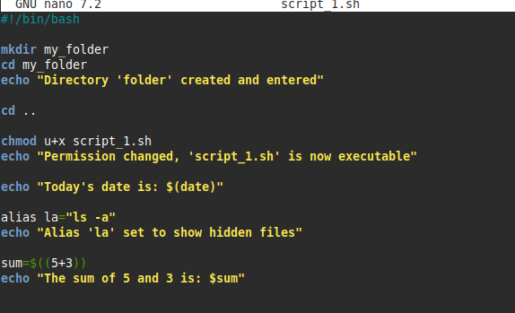

# Lab 02 — Scripting Basics

**Script:** [`script_1.sh`](script_1.sh)

## What I did

This lab moved from single commands into a proper script. It covers making a
new directory and moving into it, changing a script's permissions so it can
be executed, printing the system date, setting up a shell alias, and doing
basic arithmetic with `$(( ))`.

- `mkdir` + `cd` to create and enter a folder
- `chmod u+x` to make the script file executable
- `date` to print the current date/time
- `alias` to create a shortcut command (`la` for `ls -a`)
- Arithmetic expansion to add two numbers

## Code

```bash
mkdir my_folder
cd my_folder
echo "Directory 'folder' created and entered"

cd ..

chmod u+x script_1.sh
echo "Permission changed, 'script_1.sh' is now executable"

echo "Today's date is: $(date)"

alias la="ls -a"
echo "Alias 'la' set to show hidden files"

sum=$((5+3))
echo "The sum of 5 and 3 is: $sum"
```

## Output


