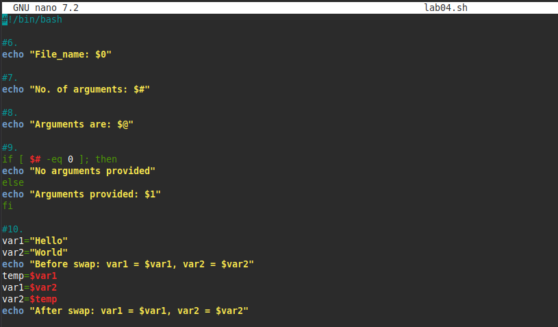

# Lab 04 — Command-Line Arguments

**Script:** [`lab04.sh`](lab04.sh)

## What I did

This lab covered how a script can see its own name and the arguments passed
to it, how to branch based on whether arguments were given, and a classic
exercise: swapping the values of two variables using a temporary variable.

- `$0` — the name of the script itself
- `$#` — the number of arguments passed in
- `$@` — all the arguments passed in
- Conditional check on argument count
- Swapping two variables with a `temp` variable

## Code

```bash
echo "File_name: $0"
echo "No. of arguments: $#"
echo "Arguments are: $@"

if [ $# -eq 0 ]; then
	echo "No arguments provided"
else
	echo "Arguments provided: $1"
fi

var1="Hello"
var2="World"
echo "Before swap: var1 = $var1, var2 = $var2"
temp=$var1
var1=$var2
var2=$temp
echo "After swap: var1 = $var1, var2 = $var2"
```

## Output


