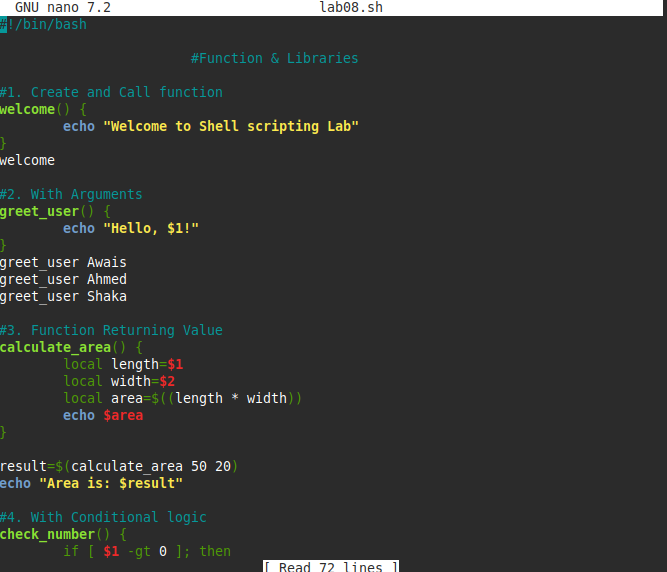
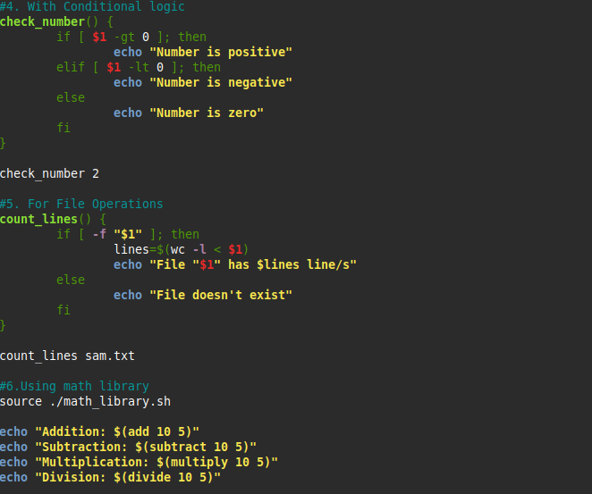
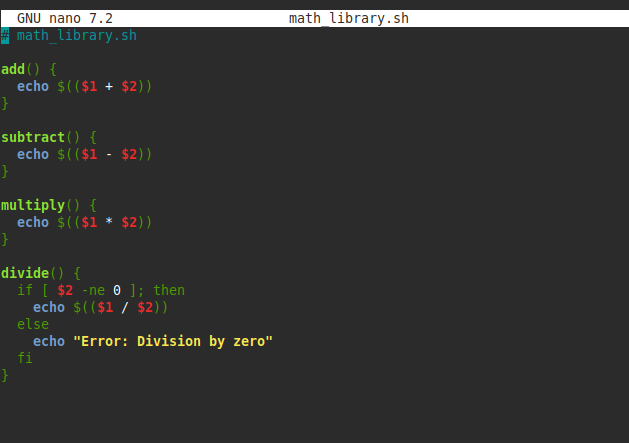

# Lab 08 — Functions & Libraries

**Scripts:** [`lab08.sh`](lab08.sh) · [`math_library.sh`](math_library.sh)

## What I did

This lab introduced functions: defining and calling them, passing arguments,
returning a value (via `echo` + command substitution), using conditional
logic inside a function, and applying a function to a real file-operations
task (counting lines in a file). It finished with sourcing a separate
library file (`math_library.sh`) for reusable math functions, and writing a
regex-based input validator.

- Defining a function with no arguments and calling it
- Passing arguments to a function (`$1`)
- Returning a value from a function via `echo`/command substitution
- `if`/`elif`/`else` inside a function (`check_number`)
- A file-operations function (`count_lines`) using `wc -l`
- `source ./math_library.sh` to pull in an external library of functions
- A regex-based validator (`[[ "$1" =~ ^[0-9]+$ ]]`) for positive integers

## Code

```bash
welcome() {
	echo "Welcome to Shell scripting Lab"
}
welcome

greet_user() {
	echo "Hello, $1!"
}
greet_user Awais

calculate_area() {
	local length=$1
	local width=$2
	local area=$((length * width))
	echo $area
}
result=$(calculate_area 50 20)

source ./math_library.sh
echo "Addition: $(add 10 5)"

validate_number() {
  if [[ "$1" =~ ^[0-9]+$ ]]; then
    echo "Valid positive integer."
  else
    echo "Invalid input."
  fi
}
validate_number 123
```

`math_library.sh`:

```bash
add()      { echo $(($1 + $2)); }
subtract() { echo $(($1 - $2)); }
multiply() { echo $(($1 * $2)); }
divide() {
  if [ $2 -ne 0 ]; then
    echo $(($1 / $2))
  else
    echo "Error: Division by zero"
  fi
}
```

## Output

**Functions: create/call, arguments, return value**



**Conditional logic, file operations, math library**



**Input validation**


