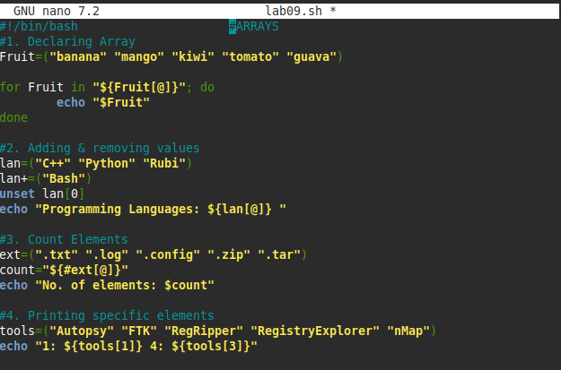

# Lab 09 — Arrays (Basics)

**Script:** [`lab09.sh`](lab09.sh)

## What I did

This lab was an intro to bash arrays: declaring one, looping over its
elements, adding and removing elements, counting how many elements an array
has, and pulling out specific elements by index.

- Declaring an array and looping over it with `"${array[@]}"`
- Appending an element with `+=`
- Removing an element with `unset array[index]`
- Counting elements with `"${#array[@]}"`
- Indexing individual elements, e.g. `"${tools[1]}"`

## Code

```bash
Fruit=("banana" "mango" "kiwi" "tomato" "guava")
for Fruit in "${Fruit[@]}"; do
	echo "$Fruit"
done

lan=("C++" "Python" "Rubi")
lan+=("Bash")
unset lan[0]
echo "Programming Languages: ${lan[@]} "

ext=(".txt" ".log" ".config" ".zip" ".tar")
count="${#ext[@]}"
echo "No. of elements: $count"

tools=("Autopsy" "FTK" "RegRipper" "RegistryExplorer" "nMap")
echo "1: ${tools[1]} 4: ${tools[3]}"
```

## Output


